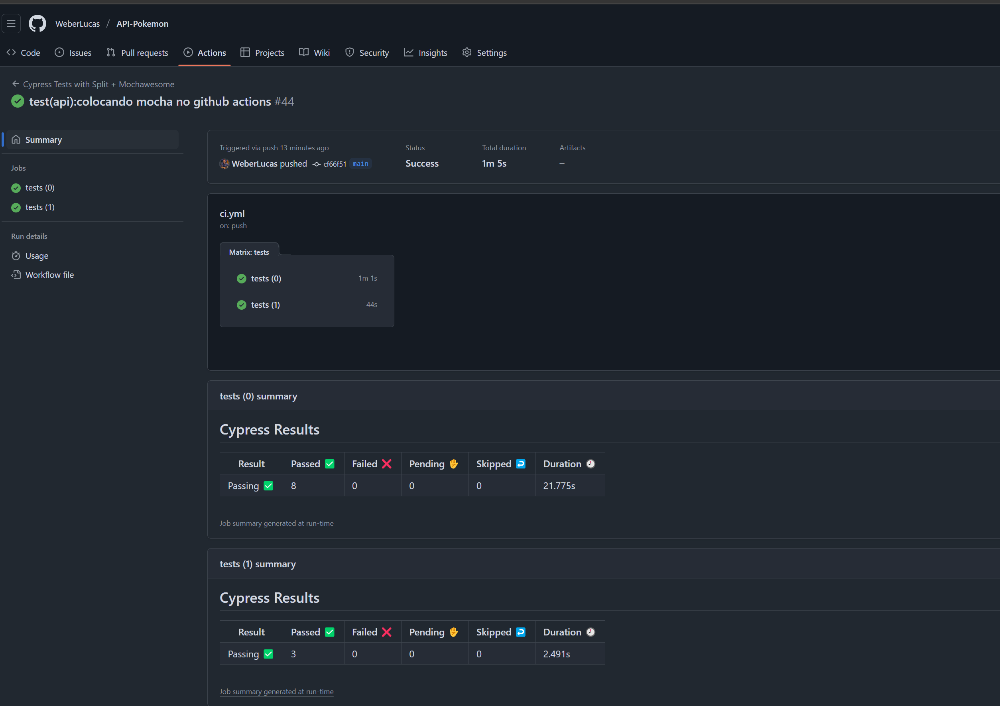
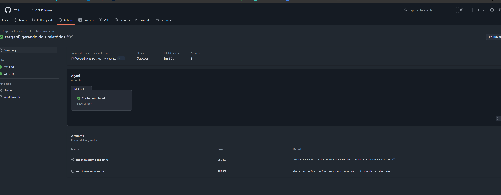

# 🧪 Testes Automatizados - PokeAPI com Cypress

Este projeto contém testes automatizados usando Cypress, com foco em testes de API na [PokeAPI](https://pokeapi.co/).

## 🔧 Tecnologias

- [Cypress](https://www.cypress.io/)
- [cypress-plugin-api](https://www.npmjs.com/package/cypress-plugin-api)
- [mochawesome](https://www.npmjs.com/package/mochawesome)
- JavaScript
- Node.js

## ▶️ Como executar os testes

1. Clone este repositório:
   ```bash
   git clone https://github.com/WeberLucas/API-Pokemon.git
   cd API-Pokemon
   ```

2. Instale as dependências:
   ```bash
   npm install 
   ```

3. Execute os testes em modo headless com relatório:
   ```bash
   npx cypress run || npm run test
   ```

   Ou, modo interativo:
   ```bash
   npx cypress open || npm run cy:open

   ```

## 📦 Plugins

### ✅ Cypress Plugin API

Este plugin facilita o uso de API em modo interativo(Open).Mostrando a requição na interface gráfica.


```

Importe no seu projeto:

```js
// No arquivo cypress/support/e2e.js
import 'cypress-plugin-api'
```


### ✅ Cypress Split Plugin

Permite utilizar o GitHub Actions com paralelização.

### 📊 Mochawesome

Para gerar relatórios de execução.


No `cypress.config.js`:

```js
const { defineConfig } = require('cypress')

module.exports = defineConfig({
  e2e: {
    baseUrl: 'https://pokeapi.co/api/v2',
  },
  reporter: 'mochawesome',
  reporterOptions: {
    reportDir: 'mochawesome-report',
    overwrite: false,
    html: true,
    json: true,
  },
})
```
### 🧩 Dicas sobre relatórios!

Quando baixar o projeto e executar npx cypress run ou npm run test o mochawesome report irá criar um arquivo HTML, basta abrir o mesmo para ver o relatório.

No GitHubActions eu deixei você decidir se deseja ver o relatório do próprio cypress ou do mochawesome.

Então no arquivo .github/workflows/ci.yml, está configurado para mostrar o relatório do cypress. Se você descomentar irá enviar o relatório do mochawesome para a pipeline.

## Exemplo relatório Cypress no GitHub Actions:
- [Link para acessar](https://github.com/WeberLucas/API-Pokemon/actions/runs/14539785267)

## Exemplo relatório Mochawesome (clique no ícone de download):
- [Link para acessar](https://github.com/WeberLucas/API-Pokemon/actions/runs/14539287869)


### 🧐Extras!!!!!!!

Como dito acima, eu criei um arquivo de **pipeline de GitHub Actions**.  
O **workflow de CI/CD** executa os testes de API em Cypress **sempre que commitar!** Além de gerar o relatório do Cypress Split ou do Mochawesome.


## 🧪 Exemplos de Testes

### 🔹 Consulta de Pokémon existente

```js
cy.api('GET', '/pokemon/pikachu').then((res) => {
  expect(res.status).to.eq(200)
  expect(res.body.name).to.eq('pikachu')
})
```

```js
cy.api('GET', '/pokemon/xablau').then((res) => {
  expect(res.status).to.eq(404)
})
```

## 📝 Referências

- [PokeAPI Docs](https://pokeapi.co/docs/v2)
- [Cypress](https://docs.cypress.io)
- [cypress-plugin-api](https://www.npmjs.com/package/cypress-plugin-api)
- [mochawesome](https://www.npmjs.com/package/mochawesome)

### 🔹 Erro ao buscar Pokémon inexistente


## 📋 Resumo do Mapeamento de Cenários

Foram selecionados endpoints da [PokeAPI](https://pokeapi.co/) para validação dos seguintes cenários principais:

- Validação de dados de Pokémon (`/pokemon/{id}`)
- Validação de tipos de Pokémon (`/type/{id}`)
- Validação de cadeia evolutiva de Pokémon (`/evolution-chain/{id}`)

**Cenários mapeados:**

- Validação de nome, habilidade e golpes de um Pokémon específico.
- Verificação de evolução de Pokémons.
- Confirmação de que um Pokémon pertence a um determinado tipo.
- Confirmação de múltiplos Pokémons pertencentes a um tipo específico.
- Validação de campos aleatórios de Pokémons sorteados da API.
- Validação de imagens de pokemons.
- Validação de sequência evolutiva 
- Validação de padrão da api de letra minúsculas


---

## 📄 Casos de Teste

### Endpoint: `/pokemon/{id}`

- **Validar nome e forma do Pokémon retornado**
  - Dado o ID de um Pokémon
  - Quando buscar seus dados
  - Então o nome retornado deve corresponder ao esperado.

- **Validar habilidades e movimentos do Pokémon**
  - Dado o ID de um Pokémon
  - Quando buscar seus dados
  - Então a primeira habilidade e o primeiro golpe devem ser os esperados.

- **Validar campos de um Pokémon aleatório**
  - Dado um ID aleatório
  - Quando buscar os dados do Pokémon
  - Então deve possuir:
    - Nome do tipo string
    - Habilidades como array
    - Golpes como array
    - Altura do tipo number.
- **Validar imagem do pokemon**
  - Dado o ID de um Pokémon
  - Quando buscar seus dados
  - Então a imagem do pokemon deve ser esperada
  - **Validar formato da imagem**
  - Dado o ID de um Pokémon
  - Quando buscar seus dados
  - Então a imagem do pokemon deve retornar com tipo PNG
---

### Endpoint: `/type/{id}`

- **Validar tipo de um Pokémon específico**
  - Dado o ID de um tipo
  - Quando buscar Pokémons do tipo
  - Então um Pokémon específico deve estar listado.

- **Validar múltiplos Pokémons associados ao tipo**
  - Dado o ID de um tipo
  - Quando buscar Pokémons do tipo
  - Então vários Pokémons esperados devem estar listados.

- **Validar o tipo principal do Pokémon**
  - Dado o ID do Pokémon
  - Quando buscar seus dados
  - Então o tipo principal deve ser o esperado.

---

### Endpoint: `/evolution-chain/{id}`

- **Validar a linha evolutiva de um Pokémon**
  - Dado o ID da cadeia de evolução
  - Quando buscar a evolução
  - Então a sequência de nomes dos Pokémons evoluídos deve ser exata.

 - **Validar a linha evolutiva do Ditto**
  - Dado o ID da cadeia de evolução do ditto
  - Quando buscar a evolução
  - Então retorna apenas ditto.
- **Validar que o primeiro pokemon da cadeia está com letras minúsculas**
  - Dado o ID da cadeia de evolução
  - Quando buscar a evolução
  - Então retorna o nome em letras minúsculas.
---